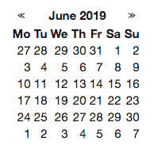

# React Dategrid

A minimal dategrid component.



## Installation

```
npm install --save react-dategrid
```

## Usage

```
import Dategrid from 'react-dategrid';

class App extends React.Component {
  renderDay(day) {
    if (moment().isSame(day, "day")) {
      return <div className="day day--today">{day.date()}</div>;
    }

    return <div className="day">{day.date()}</div>;
  }

  render() {
    return <Dategrid renderDay={this.renderDay} />;
  }
}

ReactDOM.render(<App />, document.querySelector("#app"));
```

### Props

#### className

#### renderDay

Arguments:

- day [moment instance]
    - The current day to render
- view [moment instance]
    - The current view of the calendar. Extract month, year etc from this.

#### withoutWeekdays
