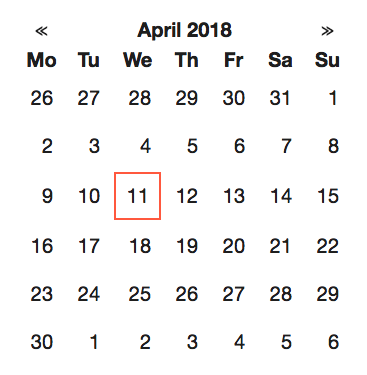

# React Dategrid

A minimal dategrid component.



## Installation

```
npm install --save react-dategrid
```

## Usage

```
import Dategrid from 'react-dategrid';

const Component = () => {
  return (
    <Dategrid
      renderDay={day => {
        return <div class="day">{day.date()}</div>
      }}
    />
  )
}
```
